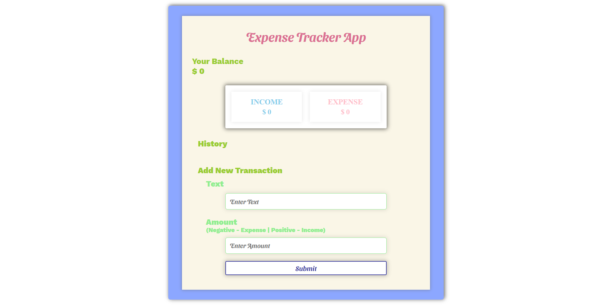

# 👨‍💻 Expense Tracker App.

## 📽 A project based on Panacloud React Bootcamp [Project 1].

### ⚒ Project Demo:

#### For Project Demo Follow the Link: http://react-exp-app.surge.sh/

### 🕵️‍♂️ Project Details:

#### This project is based on primarily on React as well as uses other libraries too! In this app you can calculate and make track of your income and expense!

### ⚙ Technical Details:

#### In this project, React with Context API and React Hooks is used for the project. Other Libraries used includes Cuid, React-Toastify and Styled-Components.

### 🤹‍♂️ Skill:

&nbsp;&nbsp;&nbsp;&nbsp;
&nbsp;&nbsp;&nbsp;&nbsp;
&nbsp;&nbsp;&nbsp;&nbsp;

### ✔ Contributers:

  <a href="https://github.com/m-zeeshan-saeed">
    &nbsp&nbsp&nbsp&nbsp&nbsp&nbsp&nbsp&nbsp&nbsp&nbsp&nbsp&nbsp
  </a>

### 📷 Project UI:

  <a href="http://react-exp-app.surge.sh/">
    &nbsp&nbsp&nbsp&nbsp&nbsp&nbsp&nbsp&nbsp&nbsp&nbsp&nbsp&nbsp
  </a>

